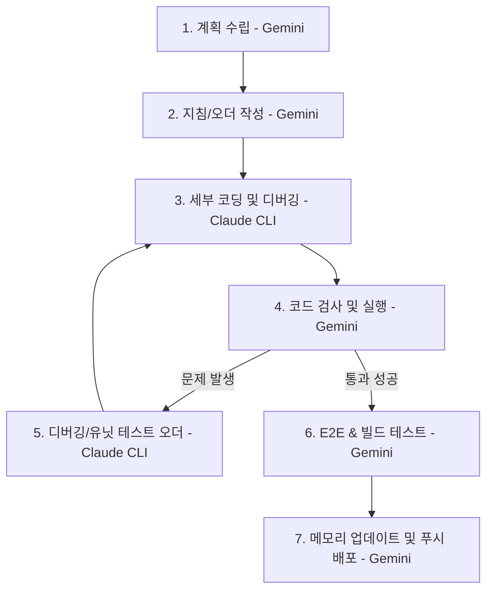

# 🤝 개발 협업 프로세스 (WORKFLOW.md)

이 프로젝트는 **Gemini (Antigravity)**와 **Claude Code CLI** 간의 명확한 역할 분담 및 협업 프로세스를 기반으로 개발 및 배포를 진행합니다.

---

## 👥 역할 분담 (Roles & Responsibilities)

### 1. Gemini (Antigravity)
* **계획 및 총괄**: 전체 개발 방향성 설계, 요구사항 분석 및 아키텍처 계획 수립.
* **통합 검증 및 검사**: 개발 완료된 코드 검토, 로컬 빌드 테스트, E2E(End-to-End) 테스트 수행.
* **형상 관리 및 배포**: 최종 검증 완료 후 작업 내역 정리, Git 스테이징/커밋(메모리 업데이트) 및 원격 저장소 푸시(배포).

### 2. Claude Code CLI
* **세부 코딩**: Gemini가 작성한 상세 파일 지침 및 명령어(오더)를 수신하여 실제 소스 코드 구현.
* **디버깅 및 유닛 테스트**: 개발 과정에서 발생하는 오류 디버깅 및 유닛 테스트 작성/통과 수행.

---

## 🔄 협업 워크플로우 (Collaboration Workflow)

1. **계획 수립 및 분석 (Gemini)**: 요구사항을 분석하고 기능 구현을 위한 상세 지침을 작성합니다.
2. **지침 전달 (Gemini)**: 수정할 파일과 작업 명령어(Claude 오더)를 `CLAUDE_TASKS.md` 및 대화 세션에 정리하여 남깁니다.
3. **세부 코딩 및 구현 (Claude CLI)**: 지침에 따라 상세 코딩 및 유닛 테스트 작업을 수행합니다.
4. **검사 및 실행 (Gemini)**: 작업이 완료되면 Gemini가 코드를 검토하고 실행해 봅니다.
5. **디버깅/유닛 테스트 (Claude CLI)**: 실행 도중 버그가 발견되면 Gemini가 오더를 남겨 Claude가 디버깅 및 유닛 테스트를 하도록 합니다.
6. **E2E 및 빌드 테스트 (Gemini)**: 오류가 해결되면 Gemini가 빌드 및 종합 기능 테스트(E2E)를 수행합니다.
7. **메모리 업데이트 및 배포 (Gemini)**: 모든 테스트가 통과하면 Gemini가 Git 커밋(메모리 업데이트) 및 푸시(배포)를 처리합니다.
